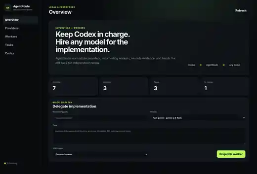
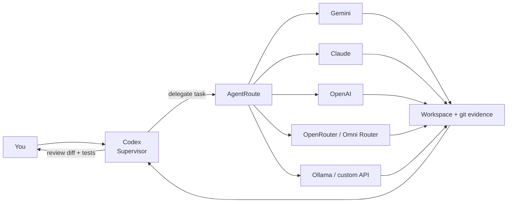
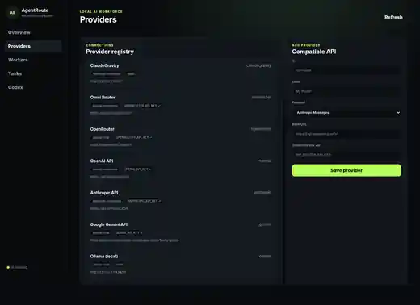

<div align="center">

# AgentRoute

### Keep Codex in charge. Route implementation work to any model.

A local, model-agnostic worker layer for coding supervisors.  
Codex plans and reviews. AgentRoute delegates implementation to Gemini, Claude, OpenAI, OpenRouter, Omni Router, Ollama, or any compatible API.

[**Русский**](README.ru.md) · **English**

[](https://github.com/dantegolf/AgentRoute/actions/workflows/ci.yml)


</div>

---

AgentRoute turns other AI models into **implementation workers** for a stronger supervisor such as Codex.

You keep one conversation with Codex. Codex can investigate the repository, decide what should be built, write acceptance criteria, delegate a bounded coding task to AgentRoute, and then independently review the resulting diff and tests.

> **Workers implement. The supervisor accepts.**  
> AgentRoute never treats a worker's final message as proof that the code is correct. A successful worker run ends in **review required**.

<p align="center">
  
</p>

## How it works



1. **Codex understands the task** — repository context, design and acceptance criteria stay with the supervisor.
2. **AgentRoute picks a worker profile** — provider, model, turn limit and shell policy.
3. **The worker implements** — using workspace-scoped read/write/search/shell tools in the current checkout or an isolated git worktree.
4. **Codex reviews real evidence** — status, diff, new files, `git diff --check`, tests/lint/typecheck/build.

## Why AgentRoute?

- **Model-agnostic** — route work by protocol instead of hard-coding one vendor.
- **Codex-first, not Codex-only** — today there is a Codex skill; the worker layer itself is supervisor-agnostic.
- **Local-first** — WebUI and control API bind to `127.0.0.1` by default.
- **Review by design** — implementation results return to the supervisor instead of silently becoming "done".
- **Worktree isolation** — recommended mode gives every delegated task its own branch and checkout.
- **Bring your own endpoint** — direct APIs, local gateways and OpenAI/Anthropic-compatible routers all fit the same worker model.

## Web interface

The WebUI is a small local control plane for providers, worker profiles, tasks and Codex integration.

<details open>
<summary><b>Provider registry</b></summary>
<br>
<p align="center">
  
</p>
</details>

From the UI you can:

- add or edit compatible providers;
- discover model IDs when the provider exposes `/models`;
- build named worker profiles such as `fast-gemini`, `deep-claude`, or `local-qwen`;
- dispatch a task manually;
- inspect execution history;
- install the Codex skill and toggle optional automatic delegation.

The screenshots show an example local setup; API secrets are not exposed to the browser.

## Quick start

### Requirements

- Node.js **20+**
- Git
- at least one model/API with function or tool calling support

### Run from source

```bash
git clone https://github.com/dantegolf/AgentRoute.git
cd AgentRoute
npm install
npm link
agentroute serve
```

Open:

```text
http://127.0.0.1:19777/
```

The first run creates:

```text
~/.agentroute/config.json
~/.agentroute/tasks/
~/.agentroute/worktrees/
```

## Providers

AgentRoute's core understands **wire protocols**, not model brands:

- `anthropic-messages`
- `openai-chat`
- `openai-responses`

Built-in presets make common providers quick to configure:

| Provider | Default protocol | Default base URL |
| --- | --- | --- |
| ClaudeGravity | Anthropic Messages | `http://127.0.0.1:18080` |
| Omni Router | OpenAI Responses | `https://api.omnirouter.ru/v1` |
| OpenRouter | OpenAI Chat | `https://openrouter.ai/api/v1` |
| OpenAI | OpenAI Responses | `https://api.openai.com/v1` |
| Anthropic | Anthropic Messages | `https://api.anthropic.com` |
| Google Gemini | OpenAI Chat | `https://generativelanguage.googleapis.com/v1beta/openai` |
| Ollama | OpenAI Chat | `http://127.0.0.1:11434/v1` |

Custom compatible endpoints can be added from the WebUI or config.

### Credentials

Prefer environment variables:

```bash
export OMNIROUTER_API_KEY="..."
export OPENROUTER_API_KEY="..."
export OPENAI_API_KEY="..."
export ANTHROPIC_API_KEY="..."
export GEMINI_API_KEY="..."
```

The WebUI can report whether an expected variable exists, but does **not** return its value.

## Workers

A worker is just a named combination of a provider, model and execution policy.

```json
{
  "workers": {
    "fast-gemini": {
      "provider": "gemini",
      "model": "your-gemini-model-id",
      "maxTurns": 24,
      "allowShell": true
    },
    "deep-claude": {
      "provider": "anthropic",
      "model": "your-claude-model-id",
      "maxTurns": 32,
      "allowShell": true
    }
  },
  "defaults": {
    "worker": "fast-gemini",
    "workspaceMode": "worktree"
  }
}
```

Model IDs are intentionally not pinned. Use the exact ID exposed by your provider/account.

## Use with Codex

Install the global skill:

```bash
agentroute codex install
```

Then ask naturally:

```text
Delegate the implementation to AgentRoute using fast-gemini.
You own the final review: inspect the diff and run the relevant tests yourself.
```

Or in Russian:

```text
Отдай реализацию AgentRoute worker fast-gemini, а сам проверь итоговый diff и тесты.
```

Optional automatic delegation:

```bash
agentroute codex auto on
```

Disable it at any time:

```bash
agentroute codex auto off
```

The auto policy is deliberately conservative: architecture, ambiguous debugging, security-sensitive changes and final acceptance stay with Codex. An explicit request such as **"do it yourself / не делегируй"** always wins.

## Direct CLI delegation

AgentRoute can also be called directly:

```bash
agentroute delegate \
  --repo /path/to/project \
  --worker fast-gemini \
  --workspace worktree \
  --task "Implement the agreed retry policy and add regression tests"
```

For longer supervisor-generated tasks:

```bash
agentroute delegate \
  --repo /path/to/project \
  --worker deep-claude \
  --task-file /tmp/agentroute-task.md
```

The result contains the workspace path, worker report and independent git evidence. `reviewRequired` remains true after implementation.

## Workspace modes

### `worktree` — recommended

Each task gets an isolated branch and checkout:

```text
~/.agentroute/worktrees/<repo>-<hash>/<task-id>
branch: agentroute/<task-id>
```

The worker cannot accidentally mix its implementation with the supervisor's current checkout.

### `current`

The worker edits the current repository. AgentRoute captures the pre-task git status so existing user changes remain visible to the reviewer.

## What comes back for review

AgentRoute records more than the worker's prose summary:

- pre-task worktree status;
- current `git status`;
- `git diff --stat`;
- `git diff --check`;
- full tracked diff;
- evidence for newly created/untracked files;
- task metadata and JSONL event history.

That evidence is what the supervisor should review.

## Security model

AgentRoute is a **local developer tool**, not a complete security sandbox.

- WebUI binds to loopback by default.
- Browser-facing config redacts static credentials.
- API keys can stay in environment variables.
- Worker shell processes receive a sanitized environment with variables resembling keys/tokens/secrets/passwords removed.
- File tools reject paths and symlinks escaping the workspace.
- Worker shell blocks commit, push, hard-reset and force-clean operations.
- Worktree mode limits accidental damage to the supervisor checkout.

Shell access is still normal OS process execution. For untrusted models or repositories, disable shell or run AgentRoute inside a container/VM.

## Project layout

```text
src/
  agent/         coding worker loop + tools
  providers/     protocol adapters
  cli.mjs        CLI
  codex.mjs      Codex integration
  config.mjs     provider + worker registry
  server.mjs     local API + WebUI
  tasks.mjs      task/event history
  workspace.mjs  checkout/worktree handling
skills/
  agentroute-delegate/
web/
test/
```

See [`docs/architecture.md`](docs/architecture.md) for the extension model.

## Roadmap

- patch review / accept / reject in the WebUI;
- routing by capability such as `fast`, `cheap`, `deep`, `tests`, `frontend`;
- cost and token accounting;
- budgets, timeouts and concurrency limits;
- parallel workers in isolated worktrees;
- structured supervisor repair loops;
- stronger container/OS sandbox backends;
- MCP server so other supervisors can use the same worker pool.

## Status

AgentRoute is an **early MVP**. The core provider adapters, tool loop, workspace isolation, evidence capture, model discovery and secret redaction are covered by regression tests and CI on Linux, macOS and Windows.

Contributions and experiments with additional compatible providers are welcome.

## License

MIT
