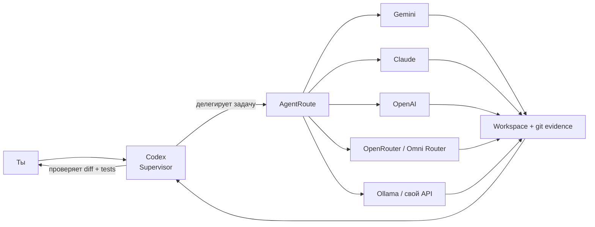

<div align="center">

# AgentRoute

### Codex остаётся главным. Реализацию можно отдавать любой модели.

Локальный, независимый от конкретной нейросети слой рабочих агентов для coding-supervisor'ов.  
Codex планирует и проверяет, а AgentRoute передаёт реализацию Gemini, Claude, OpenAI, OpenRouter, Omni Router, Ollama или любому совместимому API.

**Русский** · [English](README.md)

[](https://github.com/dantegolf/AgentRoute/actions/workflows/ci.yml)


</div>

---

AgentRoute превращает другие AI-модели в **исполнителей по реализации** для более сильного supervisor'а — например Codex.

Ты продолжаешь работать в одном диалоге с Codex. Он может разобраться в репозитории, принять архитектурные решения, сформулировать критерии готовности, отдать изолированную задачу AgentRoute, а затем независимо проверить реальный diff и тесты.

> **Worker пишет код. Supervisor принимает результат.**  
> AgentRoute не считает текстовый отчёт модели доказательством корректности. Успешная реализация заканчивается состоянием **требуется review**.

<p align="center">
  
</p>

## Как это работает



1. **Codex понимает задачу** — контекст репозитория, архитектура и критерии готовности остаются у supervisor'а.
2. **AgentRoute выбирает worker profile** — provider, модель, лимит шагов и политика shell.
3. **Worker реализует задачу** — читает и меняет файлы через ограниченные workspace tools, работает в текущем checkout или отдельном git worktree.
4. **Codex проверяет реальные изменения** — status, diff, новые файлы, `git diff --check`, тесты, lint, typecheck, build.

## Зачем AgentRoute

- **Не привязан к модели** — маршрутизация строится вокруг API-протоколов, а не одного вендора.
- **Codex-first, но не Codex-only** — сейчас есть готовый Codex skill, само ядро worker'ов не зависит от supervisor'а.
- **Local-first** — WebUI и control API по умолчанию слушают только `127.0.0.1`.
- **Review заложен в архитектуру** — worker возвращает реализацию supervisor'у, а не сам объявляет задачу окончательно выполненной.
- **Изоляция через worktree** — рекомендуемый режим создаёт отдельную ветку и checkout на каждую delegated task.
- **Можно подключить свой endpoint** — прямые API, локальные gateway и OpenAI/Anthropic-compatible routers работают через одну модель worker'а.

## Web-интерфейс

WebUI — это небольшой локальный control plane для providers, worker profiles, истории задач и интеграции с Codex.

<details open>
<summary><b>Реестр провайдеров</b></summary>
<br>
<p align="center">
  
</p>
</details>

Через интерфейс можно:

- добавлять и редактировать совместимые providers;
- получать реальные model IDs через `/models`, если provider это поддерживает;
- собирать именованные профили вроде `fast-gemini`, `deep-claude` или `local-qwen`;
- вручную запускать delegated task;
- смотреть историю запусков;
- установить Codex skill и включить/выключить автоматическое делегирование.

На скриншотах показана примерная локальная конфигурация. API-секреты браузеру не отдаются.

## Быстрый старт

### Требования

- Node.js **20+**
- Git
- хотя бы одна модель/API с поддержкой function/tool calling

### Запуск из исходников

```bash
git clone https://github.com/dantegolf/AgentRoute.git
cd AgentRoute
npm install
npm link
agentroute serve
```

Открой:

```text
http://127.0.0.1:19777/
```

При первом запуске создаются:

```text
~/.agentroute/config.json
~/.agentroute/tasks/
~/.agentroute/worktrees/
```

## Providers

Ядро AgentRoute знает **API-протоколы**, а не бренды моделей:

- `anthropic-messages`
- `openai-chat`
- `openai-responses`

Для популярных сервисов есть готовые presets:

| Provider | Протокол по умолчанию | Base URL |
| --- | --- | --- |
| ClaudeGravity | Anthropic Messages | `http://127.0.0.1:18080` |
| Omni Router | OpenAI Responses | `https://api.omnirouter.ru/v1` |
| OpenRouter | OpenAI Chat | `https://openrouter.ai/api/v1` |
| OpenAI | OpenAI Responses | `https://api.openai.com/v1` |
| Anthropic | Anthropic Messages | `https://api.anthropic.com` |
| Google Gemini | OpenAI Chat | `https://generativelanguage.googleapis.com/v1beta/openai` |
| Ollama | OpenAI Chat | `http://127.0.0.1:11434/v1` |

Любой другой совместимый endpoint можно добавить через WebUI или config.

### Ключи API

Лучше хранить их в переменных окружения:

```bash
export OMNIROUTER_API_KEY="..."
export OPENROUTER_API_KEY="..."
export OPENAI_API_KEY="..."
export ANTHROPIC_API_KEY="..."
export GEMINI_API_KEY="..."
```

WebUI может показать, что нужная переменная существует, но **не возвращает её значение**.

## Workers

Worker — это просто именованная комбинация provider, модели и execution policy.

```json
{
  "workers": {
    "fast-gemini": {
      "provider": "gemini",
      "model": "your-gemini-model-id",
      "maxTurns": 24,
      "allowShell": true
    },
    "deep-claude": {
      "provider": "anthropic",
      "model": "your-claude-model-id",
      "maxTurns": 32,
      "allowShell": true
    }
  },
  "defaults": {
    "worker": "fast-gemini",
    "workspaceMode": "worktree"
  }
}
```

Model IDs специально не зашиты в код. Используй точный ID, который отдаёт выбранный provider/account.

## Использование с Codex

Установи глобальный skill:

```bash
agentroute codex install
```

После этого можно писать естественно:

```text
Отдай реализацию AgentRoute worker fast-gemini.
Сам сделай финальный review: проверь diff и запусти нужные тесты.
```

Или на английском:

```text
Delegate the implementation to AgentRoute using deep-claude.
You own the final review.
```

Опциональное автоматическое делегирование:

```bash
agentroute codex auto on
```

Выключить:

```bash
agentroute codex auto off
```

Auto-policy намеренно консервативная: архитектура, неясный debugging, security-sensitive изменения и финальное принятие результата остаются у Codex. Явная команда **«сделай сам / не делегируй»** всегда имеет приоритет.

## Прямой запуск из CLI

AgentRoute можно вызывать и без Codex:

```bash
agentroute delegate \
  --repo /path/to/project \
  --worker fast-gemini \
  --workspace worktree \
  --task "Implement the agreed retry policy and add regression tests"
```

Для длинного ТЗ:

```bash
agentroute delegate \
  --repo /path/to/project \
  --worker deep-claude \
  --task-file /tmp/agentroute-task.md
```

Результат содержит путь к workspace, отчёт worker'а и независимо собранные git-данные. После реализации `reviewRequired` остаётся `true`.

## Режимы workspace

### `worktree` — рекомендуется

Для каждой задачи создаётся отдельная ветка и checkout:

```text
~/.agentroute/worktrees/<repo>-<hash>/<task-id>
branch: agentroute/<task-id>
```

Worker не смешивает свои изменения с текущим checkout supervisor'а.

### `current`

Worker меняет текущий репозиторий. Перед запуском AgentRoute сохраняет исходный git status, чтобы reviewer видел уже существовавшие пользовательские изменения.

## Что получает supervisor после работы

AgentRoute сохраняет не только текстовый summary модели:

- git status до начала задачи;
- текущий `git status`;
- `git diff --stat`;
- `git diff --check`;
- полный tracked diff;
- данные о новых/untracked файлах;
- метаданные задачи и JSONL event history.

Именно эти данные должен проверять supervisor.

## Модель безопасности

AgentRoute — **локальный developer tool**, а не полноценная security sandbox.

- WebUI по умолчанию доступен только на loopback.
- Browser-facing config скрывает статические credentials.
- API keys можно полностью оставить в environment variables.
- Shell worker'а получает очищенное окружение без переменных, похожих на keys/tokens/secrets/passwords.
- File tools не разрешают path/symlink выход за пределы workspace.
- Worker shell блокирует commit, push, hard-reset и force-clean.
- Worktree снижает риск случайно повредить основной checkout.

При этом shell остаётся обычным OS process execution. Для недоверенных моделей или репозиториев отключай shell либо запускай AgentRoute в container/VM.

## Структура проекта

```text
src/
  agent/         worker loop + tools
  providers/     protocol adapters
  cli.mjs        CLI
  codex.mjs      интеграция с Codex
  config.mjs     provider + worker registry
  server.mjs     local API + WebUI
  tasks.mjs      история задач/events
  workspace.mjs  checkout/worktree logic
skills/
  agentroute-delegate/
web/
test/
```

Подробнее о расширении ядра — в [`docs/architecture.md`](docs/architecture.md).

## Roadmap

- review / accept / reject patch прямо в WebUI;
- routing по возможностям: `fast`, `cheap`, `deep`, `tests`, `frontend`;
- подсчёт токенов и стоимости;
- budgets, timeouts и concurrency limits;
- параллельные workers в отдельных worktrees;
- structured repair loops между supervisor и worker;
- более сильные container/OS sandbox backends;
- MCP server, чтобы тот же worker pool могли использовать другие supervisors.

## Статус

AgentRoute пока **ранний MVP**. Базовые provider adapters, tool loop, worktree isolation, сбор git evidence, model discovery и redaction секретов покрыты regression tests и CI на Linux, macOS и Windows.

Эксперименты и PR с дополнительными совместимыми providers приветствуются.

## Лицензия

MIT
